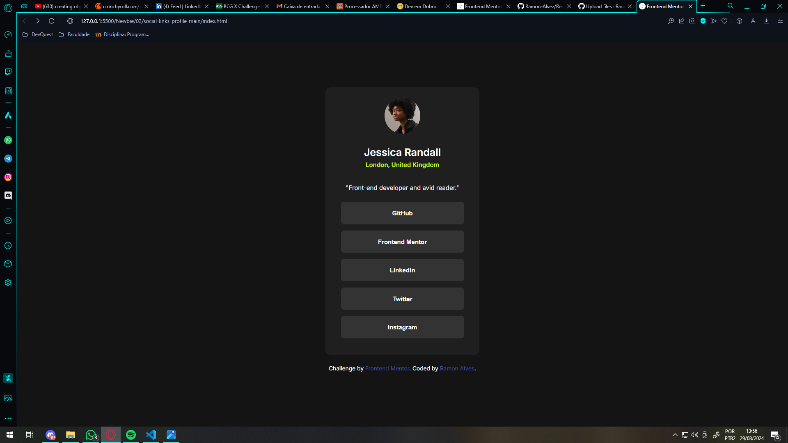
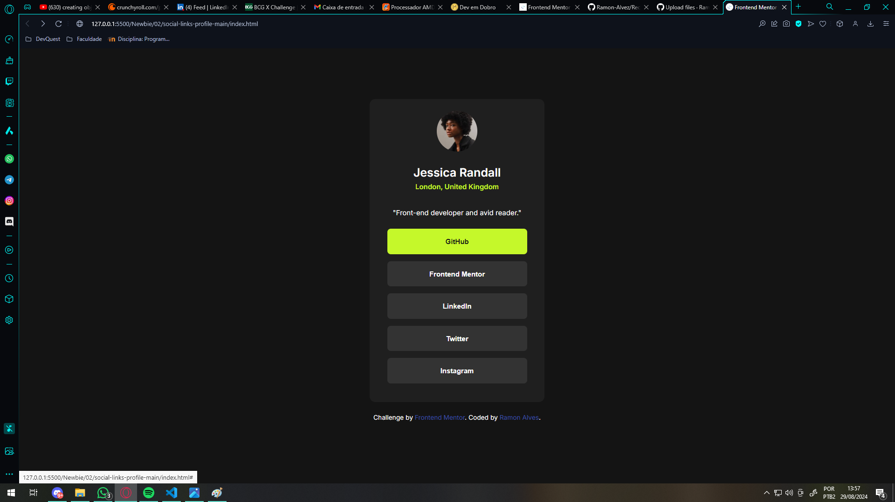
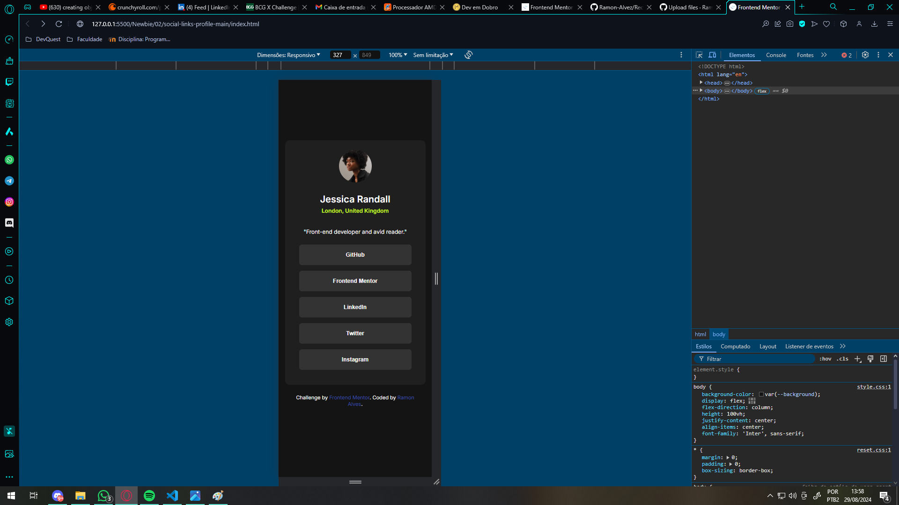
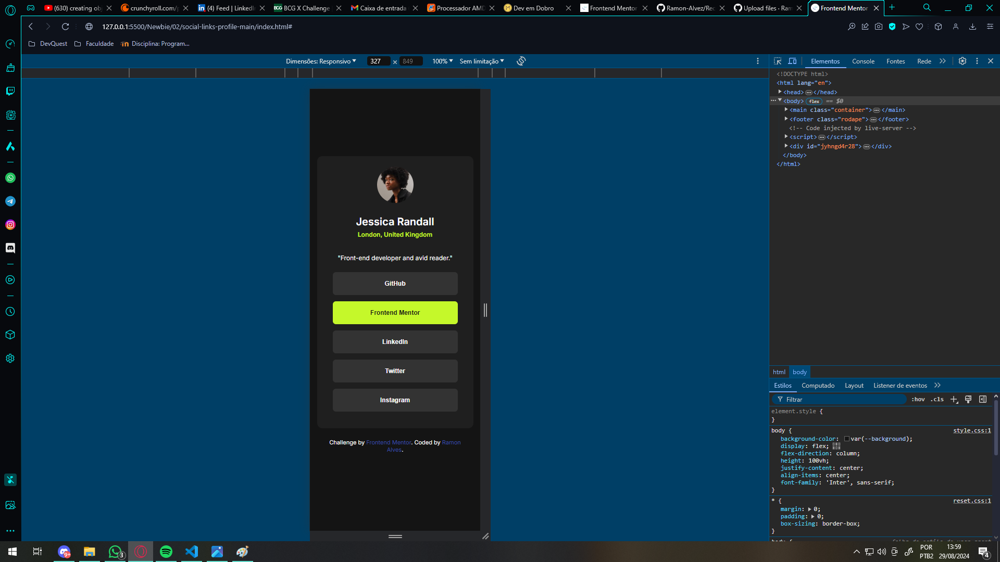

# Frontend Mentor - Social links profile solution

This is a solution to the [Social links profile challenge on Frontend Mentor](https://www.frontendmentor.io/challenges/social-links-profile-UG32l9m6dQ). Frontend Mentor challenges help you improve your coding skills by building realistic projects. 

## Table of contents

- [Overview](#overview)
  - [The challenge](#the-challenge)
  - [Screenshots](#screenshots)
  - [Links](#links)
- [My process](#my-process)
  - [Built with](#built-with)
  - [What I learned](#what-i-learned)
- [Author](#author)
- [Acknowledgments](#acknowledgments)

[Table of contents](#table-of-contents) - Click to return to the index "Table of contents"

## Overview

This is a profile page with social links, on it we have:
- A card with an avatar
- Their information:
  - Name
  - Location
  - A brief description of the person
- And their linked social networks:
  - GitHub
  - Frontend Mentor
  - LinkedIn
  - Twitter
  - Instagram

~~ Time spent: about 3 hours ~~

[Table of contents](#table-of-contents) - Click to return to the index "Table of contents"

### The challenge

Users should be able to:

- See hover and focus states for all interactive elements on the page

[Table of contents](#table-of-contents) - Click to return to the index "Table of contents"

### Screenshots

Here some pics of the solution

- Desktop (Normal)

- Desktop (Hover)

- Mobile (Normal)

- Mobile (Hover)

[Table of contents](#table-of-contents) - Click to return to the index "Table of contents"

### Links

- Solution URL: https://www.frontendmentor.io/solutions/resoluo---social-links-profile-html5-e-css-2-newbie-qazeKm_Y1X
- Live Site URL: https://ramon-alvez.github.io/Social-links-profile-Frontend-Mentor/

[Table of contents](#table-of-contents) - Click to return to the index "Table of contents"

## My process

Well, I made this project following some steps:

- HTML:
  - First, I analyzed the design and thought about the overall structure of the project;
  - Then, I structured the HTML, separating the divs, creating the main classes and formatting everything.

- CSS:
  - In CSS I started stylizing the main background and centering the card in the middle of the screen;
  - I thought about making my container inside the body to leave the footer and the main inside the container (because I like this style =p);
  - Then I aligned the text in the center, so all the card content would be centered;
  - After that, it's time to organize the "navigation":
    - I started with a structure of list and links, and I made it until the end, the hover worked fine, but when I tested the social link, it just worked when I clicked in the link, not the list. Because of that, I thought to use button, then I remade the nav structure to recive a button inside the link, I stylized the button to take the parameters (and I found it simpler than I did before)

    - Well, I guess there must be a more professional way to do this, but as there are several solutions, this was mine, If anyone sees any form of improvement, I'm glad to hear it.

[Table of contents](#table-of-contents) - Click to return to the index "Table of contents"

### Built with

- Semantic HTML5 markup
- CSS custom properties
- Flexbox

[Table of contents](#table-of-contents) - Click to return to the index "Table of contents"

### What I learned

As I said above, I really struggled with the buttons a bit, but I managed to get to the end on my own :D.

[Table of contents](#table-of-contents) - Click to return to the index "Table of contents"

## Author

- Github - [Ramon-Alvez](https://github.com/Ramon-Alvez)
- Frontend Mentor - [@Ramon-Alvez](https://www.frontendmentor.io/profile/Ramon-Alvez)
- LinkedIn - [@Ramon Alves](https://www.linkedin.com/in/ramon-alvez/)

** Note: My middle name is Alves, I just use the Z because its style =p (and LinkedIn dont allow me to use alves in my url :/)

[Table of contents](#table-of-contents) - Click to return to the index "Table of contents"

## Acknowledgments

I would like to thank the Dev community "Dev em Dobro", especially the monitor Guga for answering some of my semantic questions in this project.

@GugaS1lva https://github.com/GugaS1lva

[Table of contents](#table-of-contents) - Click to return to the index "Table of contents"