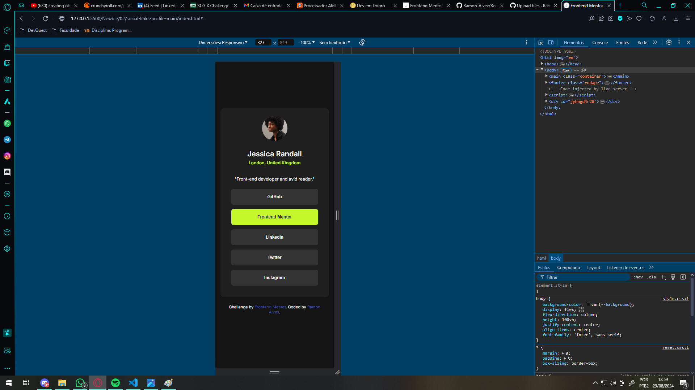

# Frontend Mentor | Solução Perfil de links sociais

Esta é uma solução para o [Social links profile challenge on Frontend Mentor](https://www.frontendmentor.io/challenges/social-links-profile-UG32l9m6dQ). Os desafios do Frontend Mentor ajudam você a melhorar suas habilidades de codificação através da construção de projetos realistas.

## Conteúdo

- [Resumo](#resumo)
  - [O desafio](#o-desafio)
  - [Prints](#prints)
  - [Links](#links)
- [Meu processo de resolução](#meu-processo-de-resolução)
  - [Feito com](#feito-com)
  - [O que aprendi](#o-que-aprendi)
- [Autor](#autor)
- [Agradecimentos](#agradecimentos)

## Resumo

Esta é uma página de Perfil com links de redes sociais, nele temos:
- Um card com um avatar
- Suas informações:
  - Nome
  - Localização
  - Um breve resumo da pessoa
- E suas redes sociais:
  - GitHub
  - Frontend Mentor
  - LinkedIn
  - Twitter
  - Instagram

~~ Tempo gasto: aproximadamente 3 horas ~~

[Índice](#conteúdo) - Clique para voltar para o índice "Conteúdo"

### O desafio

Os usuários devem ser capazes de:

- Ver o efeito do hover e os estados de foco de todos os elementos interativos na página

[Índice](#conteúdo) - Clique para voltar para o índice "Conteúdo"

### Prints

Aqui esta alguns prints da página

- Desktop (Normal)

- Desktop (Hover)

- Mobile (Normal)

- Mobile (Hover)

[Índice](#conteúdo) - Clique para voltar para o índice "Conteúdo"

### Links

- Solution URL: [Add solution URL here](https://your-solution-url.com)
- Live Site URL: [Add live site URL here](https://your-live-site-url.com)

[Índice](#conteúdo) - Clique para voltar para o índice "Conteúdo"

## Meu processo de resolução

Bom, eu fiz esse projeto seguindo os seguintes passos:

- HTML:
  - Primeiro, eu analizei o design e pensei em como ia ficar a estrutura geral do projeto;
  - Depois eu estruturei o HTML, separando as divs, criando as classes principais e formatando tudo.
  
- CSS:
  - No CSS eu comecei estilizando o background principal e centralizando o card no meio da tela;
  - Eu pensei em fazer o container dentro do body para deixar o main e o footer juntos dentro do container (porque eu gosto desse estilo =p);
  - Então eu alinhei o texto no centro, assim todo o conteúdo dentro do card seria centralizado;
  - Após isso, chegou a hora de organizar a "navegação":
    - Eu comecei com uma estrutura de lista e links e foi assim até o final, o hover estava funcionando bem, mas quando eu fui testar o link, ele só funcionava quando eu clicava no link, e não na lista. Por isso, eu pensei em usar botões, então eu refiz a estrutura do nav para receber o botão dentro do link, estilizei o botão para receber os parâmetros (e eu achei bem mais simples do que o que eu havia feito antes).

    - Bom, deve ter uma forma mais profissional de fazer isso, mascomo existem vários tipos de solução, esta foi a minha, se alguem ver alguma forma de melhoria, sou todo ouvidos.

[Índice](#conteúdo) - Clique para voltar para o índice "Conteúdo"

### Feito com

- Marcação HTML5 semântica
- CSS 
- Flexbox

[Índice](#conteúdo) - Clique para voltar para o índice "Conteúdo"

### O que aprendi

Como eu falei acima, eu realmente apanhei um pouco nos botões, mas eu consegui chegar até o final por conta própria :D.

[Índice](#conteúdo) - Clique para voltar para o índice "Conteúdo"

## Autor

- Github - [Ramon-Alvez](https://github.com/Ramon-Alvez)
- Frontend Mentor - [@Ramon-Alvez](https://www.frontendmentor.io/profile/Ramon-Alvez)
- LinkedIn - [@Ramon Alves](https://www.linkedin.com/in/ramon-alvez/)

** Nota: Meu nome do meio é Alves, Eu só uso o Z porque é legal =p (e porque o LinkedIn não deixa eu usar o Alves na minha url :/)

[Índice](#conteúdo) - Clique para voltar para o índice "Conteúdo"

## Agradecimentos

Gostaria de agradecer a comunidade dev "Dev em Dobro", especialmente o monitor Guga por me responder algumas dúvidas a respeito de semântica nesse projeto.

@GugaS1lva https://github.com/GugaS1lva

[Índice](#conteúdo) - Clique para voltar para o índice "Conteúdo"